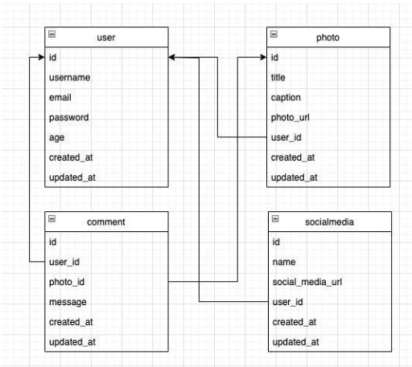

# Challange Final Project MyGram

This is a final program mygram API with user authentication and authorization. Program already use **DDD (Domain Driven Design)**.

## ERD
Here's the ERD:

## For the local output

1. Git clone first
2. Use branch development to run locally in your device
2. Set your .env
3. Set your database (postgresql)
4. Look after the postman file: ./assets/MyGram.postman_collection
5. Import the postman file to your postman.
6. Expand each folder and request to see the each example output.

## Run Program
How to run program:

    // after all set, just run command below
    `go run main.go`

## Documentation
You can access the documentation link : [http://localhost:8080/swagger/index.html](http://localhost:8080/swagger/index.html)
